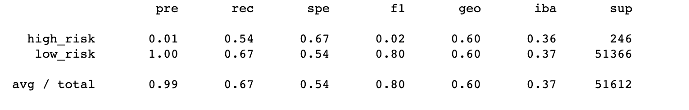
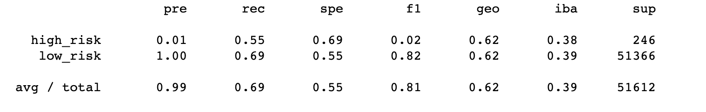
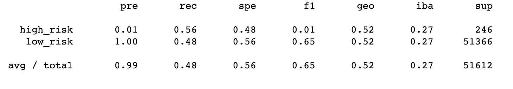
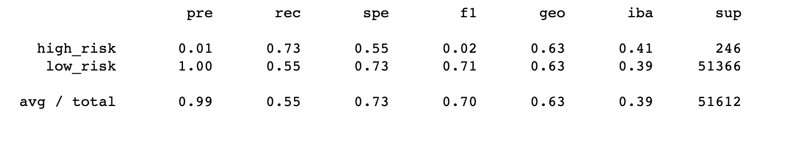
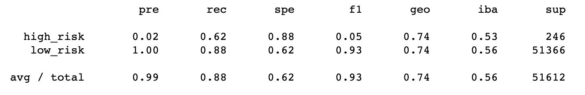
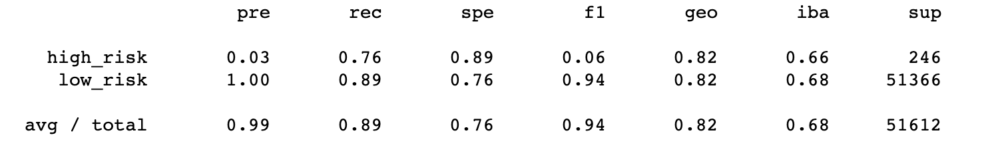

# Credit Risk Analysis
## Overview
The purpose of this analysis is to see if we can get the most accurate credit risk analysis. Using machine learning, we tried creating the most accurate and precise credit card risk analysis.
## Results
The results of this analysis is concusive. We have the following analyses:
- Naive Sampling
- SMOTE Over Sampling
- Undersampling
- SMOTEENN Sampling
- Balanced Random Forest Sampling
- Easy Ensemble Sampling

### Naive Sampling
The precision of the sampling of the high risk is a 0.01, meaning that it didn't caught almost all of the high risk credit. The low risk is at a 1 meaning that the precision of the low risk is greater. 

### SMOTE Over Sampling
The precision is similar to the Naive sampling, with the same precision values. 

### Undersampling
The precision values are the same again, with the 0.01 with the low risk and the 1.00 for the high risk. 

### SMOTEENN Sampling

### Balanced Random Forest Sampling

### Easy Ensemble Sampling

## Summary
